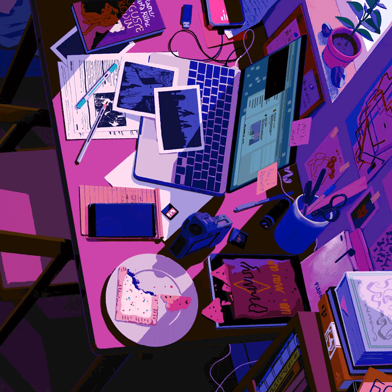

<h1>¡Hola!, Soy<a href="https://sergiolopez.com"> Sergio López</a> Desarrollador Freenlace
</h1>

  

<pre align="top">
Soy serlopDev en Github
-------------------------
💻 Soy un desarrollador full stack autodidacta
📚 Senior Full Stack Developer
📝 Interesado en las nuevas tecnologías
🌟 Principales lenguajes: PHP, JavaScript
🚩 Interesado en el desarrollo de aplicaciones web
💖 Amante del desarrollo
</pre>

 

A través de mi experiencia cómo desarrollador, formación y proyectos he desarrollado una base sólida en el diseño e implementación de soluciones basadas en mi stack tecnológico, lo que me permite crear soluciones visuales y funcionales de alto impacto. Programo siguiendo las mejores prácticas de la industria, aplicando un código limpio, optimizado y sostenible. La evolución constante es parte de mi día a día: invierto tiempo en aprender nuevas tecnologías y perfeccionar mis habilidades para ofrecer siempre un trabajo de calidad. Me caracteriza una gran atención al detalle y una habilidad para colaborar efectivamente en equipo, adaptándome a diferentes estilos de trabajo para lograr los mejores resultados.

## 🚀 Mi Stack Tecnológico:

 

<table style="border: none">
  <tr>
  <td width="50%" valign="top">

## ¡Trabajemos juntos en tu proyecto!

Si tiene alguna pregunta sobre el desarrollo web front-end, no dude en contactarnos. <a href="mailto:sergio.lofer.dev@gmail.com">contáctame por correo electrónico</a>.

Puedes contratarme como freelance en <a href="#">Fiverr</a> o <a href="https://www.linkedin.com/in/sergio-lopez-fullstack-developer/">LinkedIn</a> para desarrollar tus proyectos.

  </td>
  <td width="50%" valign="top">

## No es perfecto ¿verdad?

****

“Creo que es muy importante tener un circuito de retroalimentación, donde constantemente piensas en lo que has hecho y cómo podrías hacerlo mejor”.
– Elon Musk

  </td>
  </tr>
</table>

 

   
      <h4>“Algunos sienten la lluvia, otros solo se mojan.” — Bob Marley</h4>

<!--  -->
